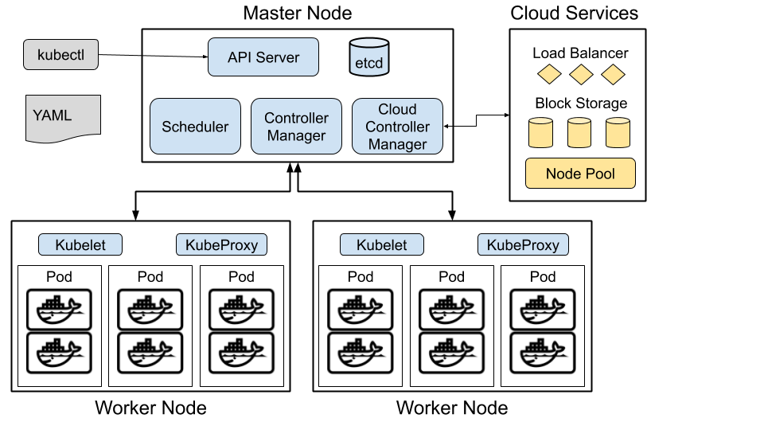

Introduction to Kubernetes
==========================

.. epigraph::

	*"Any sufficiently advanced technology is indistinguishable from magic."*

	*-- Arthur C. Clarke*

What is Kubernetes
------------------

Kubernetes is an open-source platform for managing containerized workloads and services
at scale.

The Architecture
----------------

A Kubernetes cluster contains a master node and a bunch of worker nodes. It is also possible to have more than one master in advanced setups.

Master Node Components
~~~~~~~~~~~~~~~~~~~~~~

API Server
^^^^^^^^^^
The most important component of the kubernetes is the API server. The clients and worker nodes interact with the kubernetes cluster only though the API server.

etcd
^^^^

Highly-available key-value store used for storing all the kubernes cluster-data.

Scheduler
^^^^^^^^^^^^^^

The scheduler component watches for newly created pods and assigns them to an appripriate node to run on. It takes care of the resource constrains, resource availability, node types etc. in deciding where to schedule a pod.

Controller Manager
^^^^^^^^^^^^^^^^^^

The controller manager component runs all the controllers in the kubernetes. This includes:

- Node Controller - moinitors the nodes and responds on events on them
- Replication Controller - responsible for making sure the correct number of pods are running for each replicaset

cloud-controller-manager
^^^^^^^^^^^^^^^^^^^^^^^^

The cloud-controller-manager provides the integration with the underlying cloud. Each cloud provider will have their own version of the cloud-controller-manager. This is responsible to creating load balancers, provisioning storage etc.

Node Components
---------------

Kubelet
^^^^^^^

Agent that runs on each node. It is responsible for making sure the containers are running in each pod scheduled to that node.

kube-proxy
^^^^^^^^^^

The kube-proxy is the kubenetes networking proxy that runs on each node. It is responsible for connection forwarding to make kubernetes services work seemlessly.
