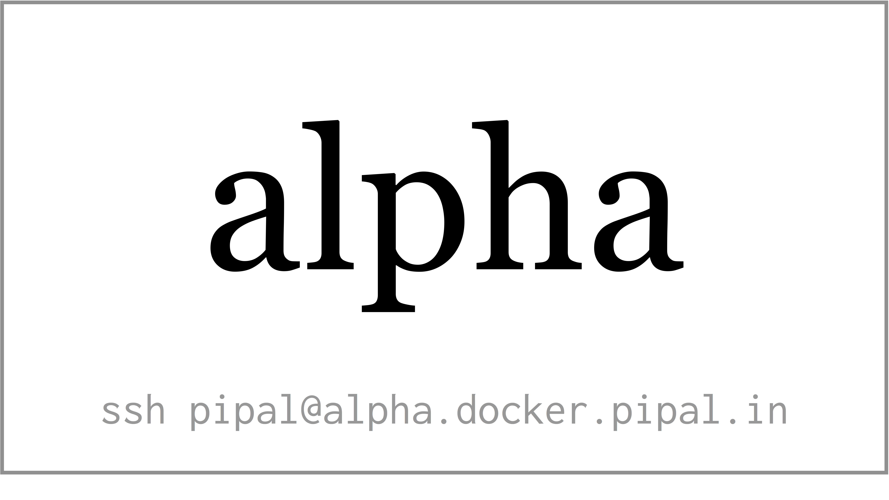

The Lab Setup
=============

.. epigraph::

	*"Everything should be made as simple as possible, but not simpler"*

	*-- Albert Einstein*

The Docker & Kubernetes Workshop comes with ready to use lab setup. Each participant gets access to a virtual machine in the cloud with all the required software, including ``docker``, ``docker-compose`` and ``kubectl`` pre-installed. Apart from the virtual machines, a kubernetes cluster is created for this workshop and all the virtual machines are configured to be able to access the kubernetes cluster. The details of the respective virtual machines will be shared with each participant at the beginning of the workshop.

The lab setup will be available during of the workshop and two more days after the workshop. The participants will not be able to use the lab after that period. The partipants are advised to setup a kubernetes cluster on a personal virtual machine.

The Virtual Machine
-------------------

A virtual machine for each participant is setup on digitalocean and the details of the hostname will be shared with a small piece of paper as shown below.

The greek letter that is assigned to each one of you is the hostname of your node and also the kubernetes namespace that you'll be using later in the workshop.

.. note::

   Please remember that the name of your node will be different from what is shown in this notes. You need replace ``alpha`` with the greek letter assigned to you in all the examples shown this chapter.

Verify the Setup
~~~~~~~~~~~~~~~~

Verify the setup by logging into the machine. The password will shared during the workshop. ::

	$ ssh pipal@alpha.docker.pipal.in
	pipal@alpha.docker.pipal.in's password:

You'll be able login once you enter the password. 

Once you login, please verify if docker is working::

	$ docker version
	Client:
	 Version:           18.09.2
	 API version:       1.39
	 Go version:        go1.10.4
	 Git commit:        6247962
	 Built:             Tue Feb 26 23:52:23 2019
	 OS/Arch:           linux/amd64
	 Experimental:      false

	Server:
	 Engine:
	  Version:          18.09.2
	  API version:      1.39 (minimum version 1.12)
	  Go version:       go1.10.4
	  Git commit:       6247962
	  Built:            Wed Feb 13 00:24:14 2019
	  OS/Arch:          linux/amd64
	  Experimental:     false

And verify if `kubectl` is working::

	$ kubectl version
	Client Version: version.Info{Major:"1", Minor:"14", GitVersion:"v1.14.2", GitCommit:"66049e3b21efe110454d67df4fa62b08ea79a19b", GitTreeState:"clean", BuildDate:"2019-05-16T16:23:09Z", GoVersion:"go1.12.5", Compiler:"gc", Platform:"linux/amd64"}
	Server Version: version.Info{Major:"1", Minor:"14", GitVersion:"v1.14.1", GitCommit:"b7394102d6ef778017f2ca4046abbaa23b88c290", GitTreeState:"clean", BuildDate:"2019-04-08T17:02:58Z", GoVersion:"go1.12.1", Compiler:"gc", Platform:"linux/amd64"}

	$ kubectl get nodes
	NAME                STATUS   ROLES    AGE   VERSION
	k8s-workshop-xii3   Ready    <none>   25m   v1.14.1
	k8s-workshop-xii8   Ready    <none>   25m   v1.14.1
	k8s-workshop-xiiu   Ready    <none>   25m   v1.14.1

If all the above commands are working for you then your lab setup is ready! Don't worry if you see slightly different name for the nodes.

The kubernetes Cluster
----------------------

A common kubernetes cluster is setup for all the participants together. The cluster has been divided into multiple namespaces so that each participant can work in his own namespace, without being effected by the work of others. The name of the kubernetes namespace is same as the hostname assigned.

The kubernetes configuration has been added to the each virtual machine to allow it to connect to the cluster.

The kubernetes cluster has been configured with an ingress-controller (more about it later) so that

Private Docker Registry
-----------------------

A private docker registry has been setup at https://registry.k8s.pipal.in/ to store docker images, this can be used to push images built during the workshop and user them with docker and kubernetes.

The Repository
--------------

The code samples used for this training and the training notes are available in `a github repository <https://github.com/pipalacademy/kubernetes-workshop/>`_. Please clone it on your node::

	$ git clone https://github.com/pipalacademy/kubernetes-workshop
