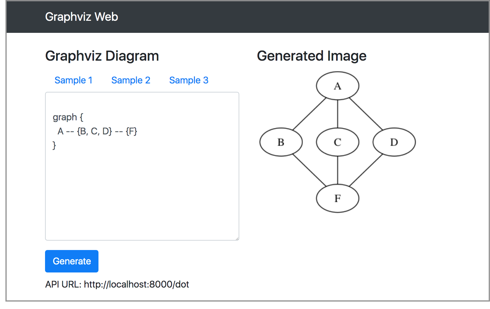
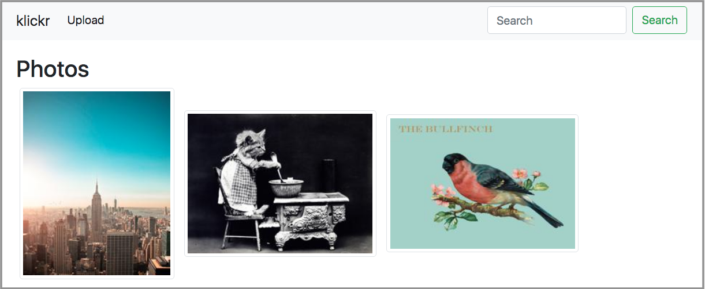

Overview of the Workshop
========================

.. epigraph::

   *"I hear and I forget. I see and I remember. I do and I understand."*

   *-- Confucius*

Welcome to the Docker & Kubernetes Workshop by Pipal Academy. This is a hands-on workshop to take you on to ride into the world of containers. 

This is a hands-on workshop and you'll spend better part of your day trying examples demonstrated by the instructor and the solving the exercise problems.

The Outline
-----------

The first day of the workshop focuses on Docker and rest of the two days are for Kubernetes. The following is the outline of workshop.

**DAY 1**

* Introduction to Docker
* Advanced Docker
* Optimizing Docker Images
* Docker Orchestration

**DAY 2**

* Introduction to Kubernetes
* Deploying Applications
* Health Checks & Auto-healing
* Advanced Container Patterns

**DAY 3**

* Scaling Up
* Managing Volumes
* Logging & Monitoring
* Kubernetes in Production

Sample Applications
-------------------

During the workshop we'll be looking at the following sample applications when practing docker and kubernetes.

Figlet & Cowsay
^^^^^^^^^^^^^^^

This is a fun application to use the popular unix programs ``figlet`` and ``cowsay`` to display messages like shown below. ::

     __________________________________________________
    /      _            _               _              \
    |   __| | ___   ___| | _____ _ __  (_)___          |
    |  / _` |/ _ \ / __| |/ / _ \ '__| | / __|         |
    | | (_| | (_) | (__|   <  __/ |    | \__ \         |
    |  \__,_|\___/ \___|_|\_\___|_|    |_|___/         |
    |                                                  |
    |                                               _  |
    |   __ ___      _____  ___  ___  _ __ ___   ___| | |
    |  / _` \ \ /\ / / _ \/ __|/ _ \| '_ ` _ \ / _ \ | |
    | | (_| |\ V  V /  __/\__ \ (_) | | | | | |  __/_| |
    |  \__,_| \_/\_/ \___||___/\___/|_| |_| |_|\___(_) |
    \                                                  /
     --------------------------------------------------
            \   ^__^
             \  (oo)\_______
                (__)\       )\/\
                    ||----w |
                    ||     ||

keywords: docker, entrypoint

Static website using nginx
^^^^^^^^^^^^^^^^^^^^^^^^^^

We'll use docker to serve a static website using nginx extend it to serve a git repo and watch for changes. Later we'll see how to model the same in kubernetes.

keywords: docker, volumes, kubernetes

Graphviz Web
^^^^^^^^^^^^

``graphviz`` is a command-line tool to render graphs specified in a domain specific language called ``dot``. The Graphviz Web application allows users to visualize the graphviz programs online. It is modelled as a 2 microservices. One service to provide an API to render the image and another to serve the HTML pages, call the API and show the result.

    The graphviz-web interface.

keywords: docker, docker-compose, kubernetes

Klickr
^^^^^^

``Klickr`` is a skimmed down clone of Flickr. It allows uploading pictures and seeing it from the web interface. It also has an offline task queue for resizing all the uploaded images.

    The klickr interface.

keywords: kubernetes, task-queue
